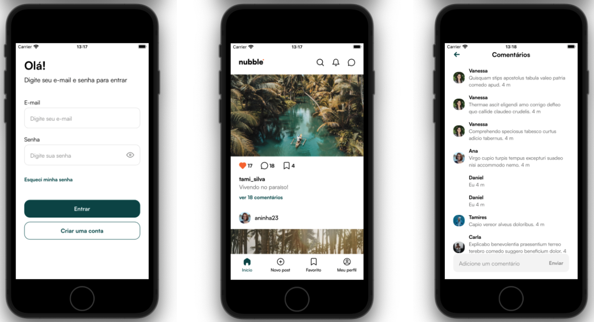

<h1 align="center">
    Nubble
</h1>

  

  <a href="#rocket-tecnologias">Tecnologias</a>&nbsp;&nbsp;&nbsp;|&nbsp;&nbsp;&nbsp;
  <a href="#-projeto">Projeto</a>&nbsp;&nbsp;&nbsp;|&nbsp;&nbsp;&nbsp;
  <a href="#memo-licença">Licença</a>

 

  

## :rocket: Tecnologias

Esse projeto foi desenvolvido com as seguintes tecnologias:

- [Typescript](https://www.javascript.com/)
- [React Native](https://facebook.github.io/react-native/)
- [Zustand](https://github.com/pmndrs/zustand)
- [Restyle](https://github.com/Shopify/restyle)

## 💻 Projeto

O Nubble é uma rede social desenvolvida com React Native.

## :memo: Licença

Esse projeto está sob a licença MIT. Veja o arquivo [LICENSE](LICENSE) para mais detalhes.

---

Feito por Daniel Sousa :wave: [LinkedIn](https://www.linkedin.com/in/danielsousast/)
